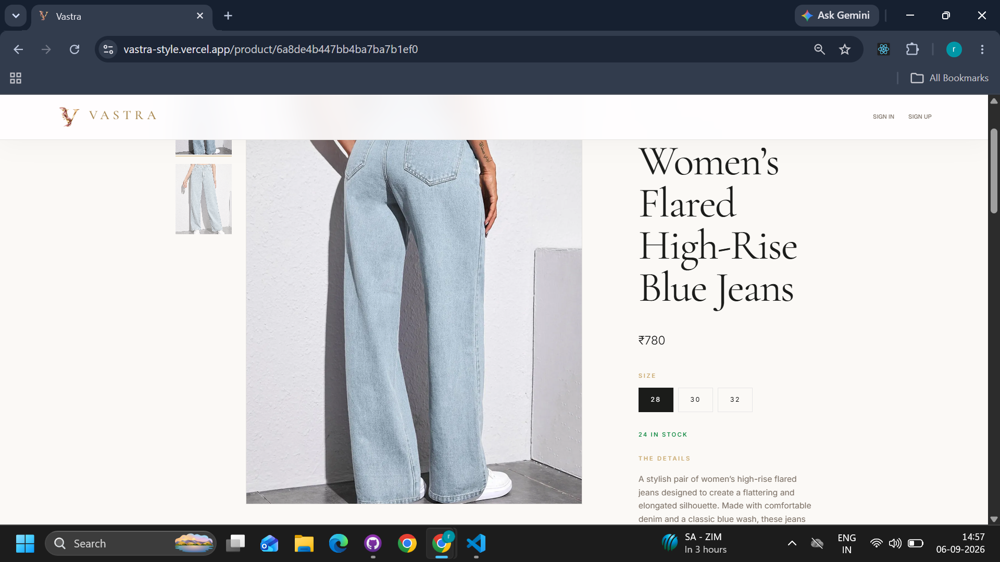
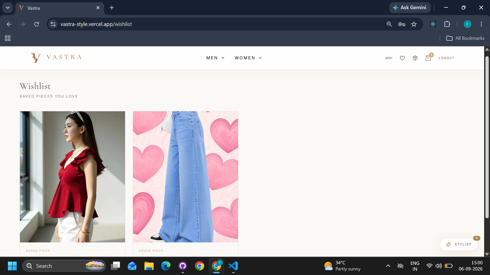
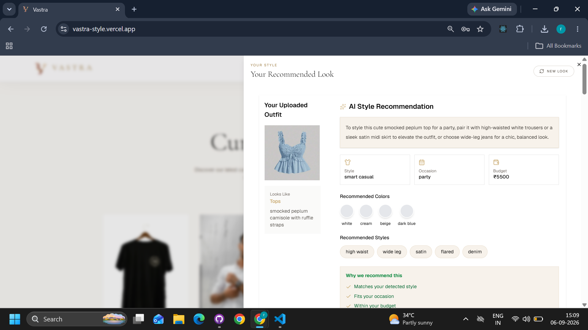
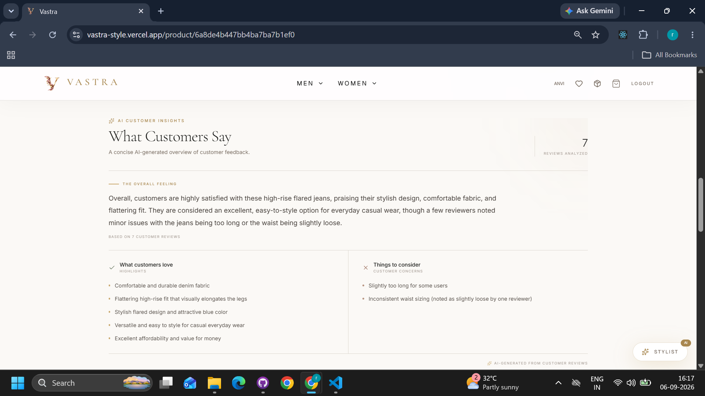
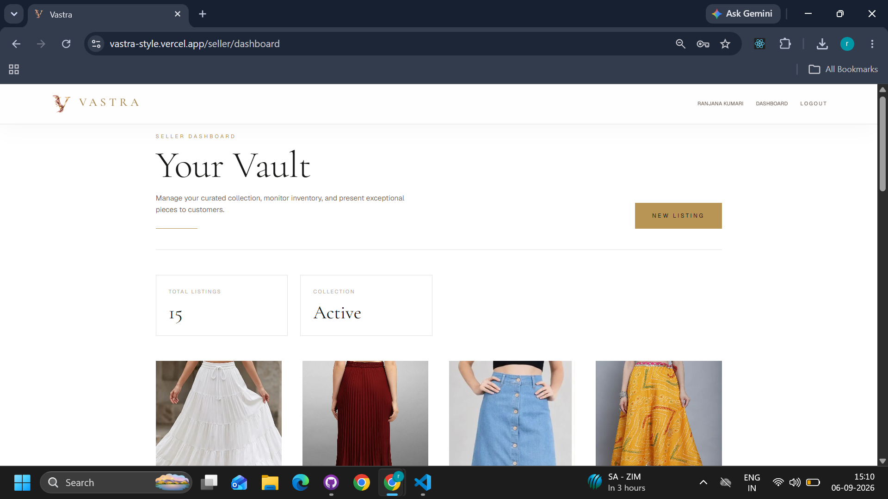

# Vastra — AI-Powered Full-Stack E-Commerce Platform

Vastra is a modern, full-stack fashion e-commerce platform built with React, Node.js, Express.js, MongoDB, and TypeScript.

The platform provides a complete shopping experience with secure authentication, product discovery, wishlist and cart management, order processing, online payments, image uploads, an admin dashboard, and AI-powered fashion features.

## Features

- User Authentication

## 👤 Authentication & Authorization

- User registration and login
- JWT-based authentication
- Secure cookie-based authentication
- Email verification
- Forgot/reset password functionality
- Google authentication
- Role-based authorization
- Protected user and admin routes

## 🛍️ Shopping Experience

- Browse products
- Product search
- Category and subcategory filtering
- Product details
- Responsive product listings
- Shopping cart
- Wishlist
- Product quantity management

## 🤖 AI-Powered Features

- AI Fashion Assistant
- Fashion recommendations based on:
- Uploaded images
- Occasion
- Budget
- User prompts
- AI-powered customer review summaries
- Customer feedback insights

## 💳 Orders & Payments

- Create and manage orders
- Order history
- Order status management
- Razorpay payment integration
- Payment verification
- Secure order processing

## 🖼️ Image Management

- Product image uploads
- ImageKit integration
- Optimized image delivery

## 🛠️ Admin Dashboard

- Admin authentication
- Product management
- Variant management
- Dashboard controls

## 📱 UI & UX

- Fully responsive design
- Modern fashion-focused interface
- Mobile-friendly navigation
- Clean and reusable components
- Loading and error states

---

## 🧑‍💻 Tech Stack

### Frontend

- React
- TypeScript
- Tailwind CSS
- Axios
- React Hook Form
- React Router
- Context API
- Redux

### Backend

- Node.js
- Express.js
- TypeScript
- MongoDB
- Mongoose
- JWT
- bcrypt
- Express Validator
- Multer

### Third-Party Services

- ImageKit — Image storage and delivery
- Razorpay — Online payments
- Google OAuth — Social authentication
- Google Gemini AI — AI-powered recommendations and review analysis
- Resend — Email services

---

## Project Structure

```text
vastra/
├── frontend/
├── backend/
└── README.md
```

---

## Setup

Clone Repository
git clone <repo-url>
cd vastra

### Backend Setup

```
cd backend
npm install
npm run dev
```

### Frontend Setup

```
cd frontend
npm install
npm run dev
```

The frontend will run on:
http://localhost:5173

---

## 🔐 Environment Variables

### Backend (.env)

Create a .env file inside the backend directory:

```env
MONGO_URI=

JWT_SECRET=

GOOGLE_CLIENT_ID=

GOOGLE_CLIENT_SECRET=

IMAGEKIT_PRIVATE_KEY=

RAZORPAY_KEY_ID=

RAZORPAY_KEY_SECRET=

GEMINI_API_KEY=

EMAIL_VERIFICATION_TOKEN=

FORGOT_PASSWORD_TOKEN=

RESEND_API_KEY=

NODE_ENV=development

PORT=3000
```

### Frontend (.env)

Create a .env file inside the frontend directory:

```env
VITE_API_URL=http://localhost:3000/

RAZORPAY_KEY_ID=
```

For production, replace the local API URL with your deployed backend URL.

---

### 🔒 Security

Vastra implements several security practices, including:

- JWT authentication
- HTTP-only cookies
- Password hashing with bcrypt
- Role-based authorization
- Protected API routes
- Request validation
- Environment variables for sensitive credentials
- Payment signature verification

---

## 🚀 Deployment

The application can be deployed using:

### Frontend

- Vercel

### Backend

- Render

### Database

- MongoDB Atlas

### Image Storage

- ImageKit

### Payments

- Razorpay

---

## 🌐 Live Demo

https://vastra-style.vercel.app/

## 📸 Screenshots

- Home page
  
- Product details
  

- Cart
  

- Wishlist
  

- Login/Register
  

- AI Fashion Assistant
  
- AI Customer Review Summary
  

- Admin Dashboard
  

## Future Enhancements

- Order Tracking
- Advanced Product Filters
- Advanced order tracking
- Real-time order updates
- Email notifications
- Advanced product filtering
- Personalized recommendations
- Coupon and discount system
- Seller/vendor management
- Improved AI styling recommendations

---

## 👨‍💻 Author

Vastra — AI- powered Full-Stack E-Commerce Project

Built as a full-stack portfolio project to demonstrate practical experience with modern frontend development, backend API development, database management, authentication, payment integration, cloud services, and AI integration.
